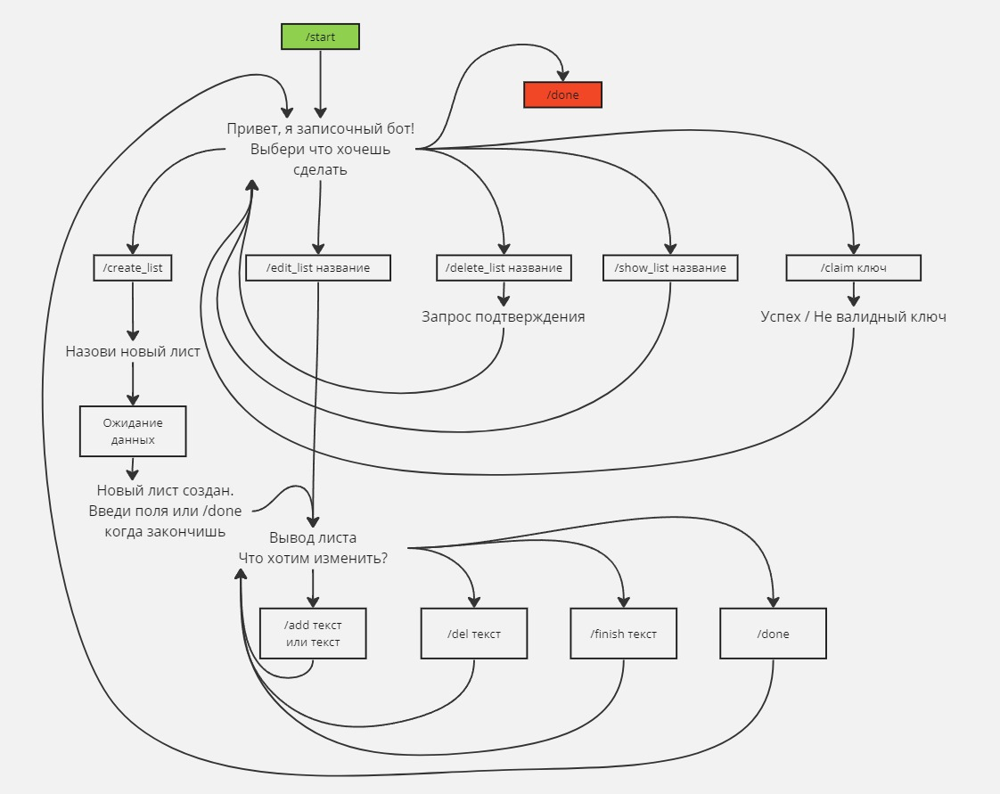

# Бот "Списки"

Что должны уметь:

- Создавать, хранить, удалять списки для множества пользователей
- Уметь редактировать, добавлять, удалять элементы (текст)
- Интерфейс (где можно) должен использовать кнопки
- inline должен уметь постить списки в чат
- У списка есть создатель, он может шерить на просмотр и редактирование
- Хранить последние изменения листа (фиксированное количество)

В проекте обещаем:

- Структуру по файлам
- Типизацию
- И пока хватит

